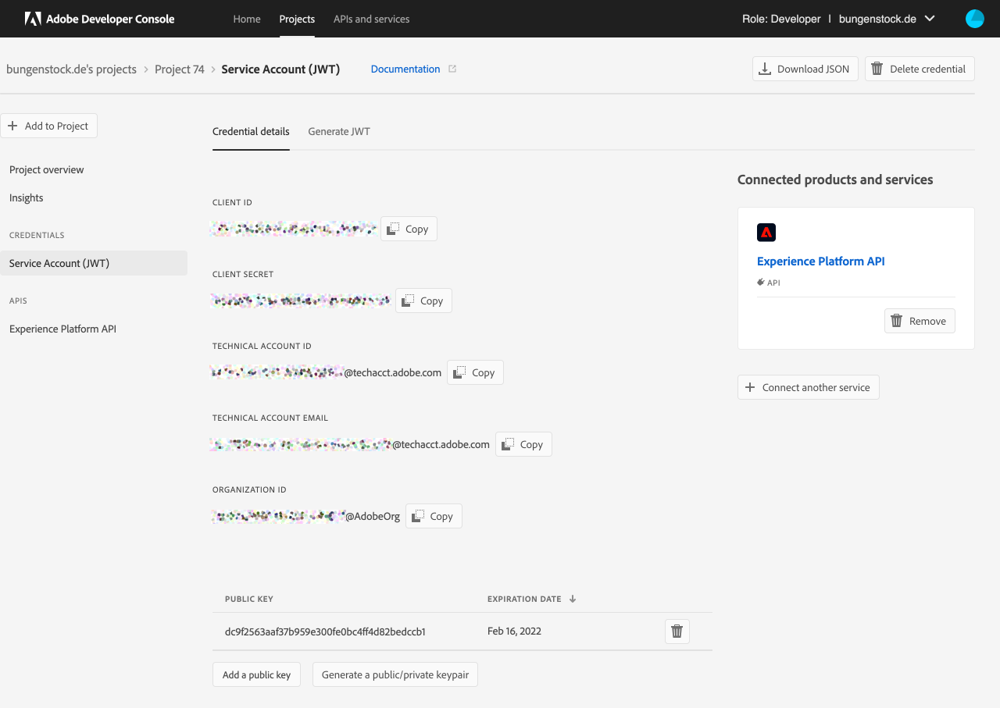
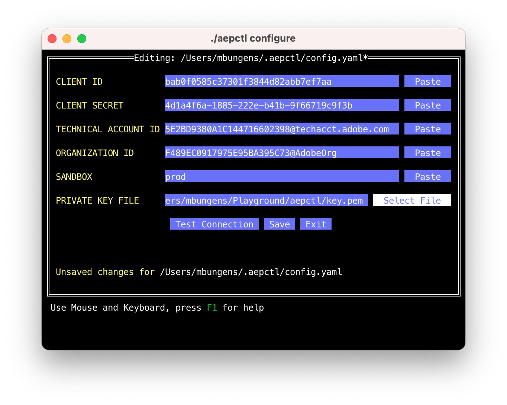
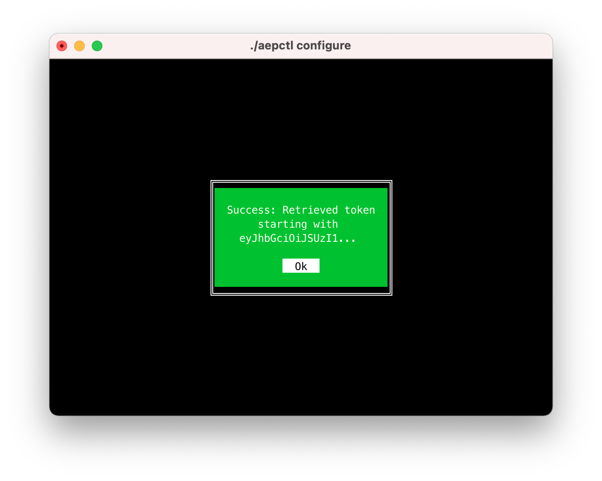

# Initial Configuration

`aepctl` uses the REST API of the AEP and requires some authentication
credentials, usually  stored in a configuration file with the name
`config.yaml`. This file can be located locally in the directory of execution
(helpful when dealing with multiple accounts) or globally in the hidden folder
`.aepctl` based in the user home directory. You can also provide an individual
path during the execution, giving you the most flexibility. If you don't want to
use a configuration file then you can provide all necessary authentication
credentials by multiple command line parameters.

## Prerequisites
`aepctl` uses a Service Account (JWT) for authentication and requires an Adobe
I/O Project including the Adobe Experience Platform API. Take a look at the
document [Create new Adobe I/O Project](new_project.md) if you haven't done
it by now.

## Getting the Parameters
The configured Adobe I/O project provides all required credentials for
authentication. Click on *Service Account(JWT)* on the left-hand side and you
should see a screen like this:



The **Copy** button is a convenient way to retrieve the first 4 values (examples
are hand-crafted for illustration, don't waste your time):

|Name | Configuration Name | Example |
|-----|--------------------|---------|
|CLIENT ID| client-id  | bab0f0585c37301f3844d82abb7ef7aa | 
|CLIENT SECRET| client-secret | 4d1a4f6a-1885-222e-b41b-9f66719c9f3b |
|TECHNICAL ACCOUNT ID|tech-account | 5E2BD9380A1C144716602398@techacct.adobe.com |
|ORGANIZATION ID | organization | F489EC0917975E95BA395C73@AdobeOrg |
|KEY | key | /Users/John/.aepctl/private.pem |
|SANDBOX | sandbox | playground |

KEY contains the path to the private key file which is stored on your computer
and SANDBOX the name of the AEP sandbox. If sandbox is not provided then `prod`
is the default value for production.

You can create and maintain the configuration file with `aepctl` or with your
preferred text editor.

## Configuration with `aepctl`

`aepctl` provides the command `configure` for a direct access to the
configuration parameters. If the file `~/.aepctl/config.yaml` does not exist then
it will create it for you.

```terminal
aepctl configure
```

This command should open a user interface supporting keyboard and mouse input
(push the Paste button on the right-hand side). Use tabulator and cursor keys
for navigation, `ENTER` for confirmation. Platform specific keyboard commands,
like `CMD+V` for paste, are working. Press `F1` for more help. 

If you come to PRIVATE KEY FILE then a file chooser will be open (mouse: click
Select File, keyboard press `ENTER`). Navigate to your private key file. If you
have generated the key pair during the project creation then you have to unzip
`config.zip` containing `private.key`. Confirm your selection and the file
chooser will return the absolute path to your private key file. Relative paths
work, too, but are not recommended. 

A completely filled out form could look like this example:


A test is recommended before saving. Press the Test Connection button and you
see hopefully the following dialog. Otherwise, the error message should give you
a hint where the problem is.


At the end press the Save button and you are done with the configuration.

## Configuration with Text Editor

If you don't want to use `aepctl configure` you can create a configuration file
with your preferred text editor. The default name of the file is `config.yaml`
and uses YAML syntax. 

### Global Configuration

Execute the following steps for a global configuration:

1. Go to your home directory
2. Create the directory `.aepctl` if it does not already exist
    ```terminal
    mkdir .aepctl
    ```
3. Create the config file `config.yaml` with your preferred editor, e.g. `vim`
    ```terminal
    vim .aepctl/config.yaml
    ```
4. Copy and paste the following YAML content to your file
   ```yaml
    #
    # 
    # aepctl configuration
    client-id:
    client-secret:
    tech-account:
    organization:
    key:
    sandbox:
    ```
5. Copy required authentication credentials from your Adobe I/O project. Your
   file should look like this:
   ```yaml
    #
    # 
    # aepctl configuration
    client-id: bab0f0585c37301f3844d82abb7ef7aa
    client-secret: 4d1a4f6a-1885-222e-b41b-9f66719c9f3b
    tech-account: 5E2BD9380A1C144716602398@techacct.adobe.com
    organization: F489EC0917975E95BA395C73@AdobeOrg
    key: /Users/John/.aepctl/private.pem
    sandbox: playground
    ```
6. Save the file and exit
7. Test your configuration by getting an access token
   ```terminal
   aepctl get token
   ```

## Command Line Flags & Environment Variables
It might be that you don't want to provide a configuration file or that you want
to overwrite specific settings in your configuration, e.g. with a different
sandbox. In this case you could use command line flags and environment
variables.

|Name | Flag | Variable |
|-----|--------------|---------|
|CLIENT ID| --client-id  | MIB_CLIENT_ID | 
|CLIENT SECRET| --client-secret| MIB_CLIENT_SECRET |
|TECHNICAL ACCOUNT ID| --tech-account | MIB_TECH_ACCOUNT |
|ORGANIZATION ID | --organization | MIB_ORGANIZATION |
|KEY | --key | MIB_KEY|
