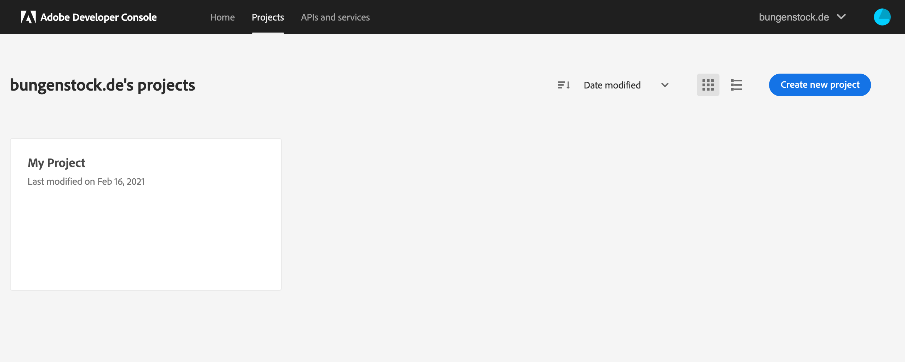
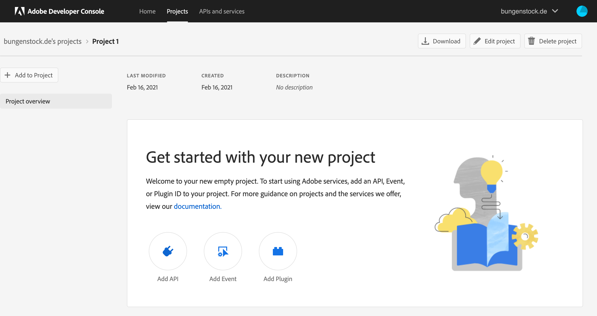
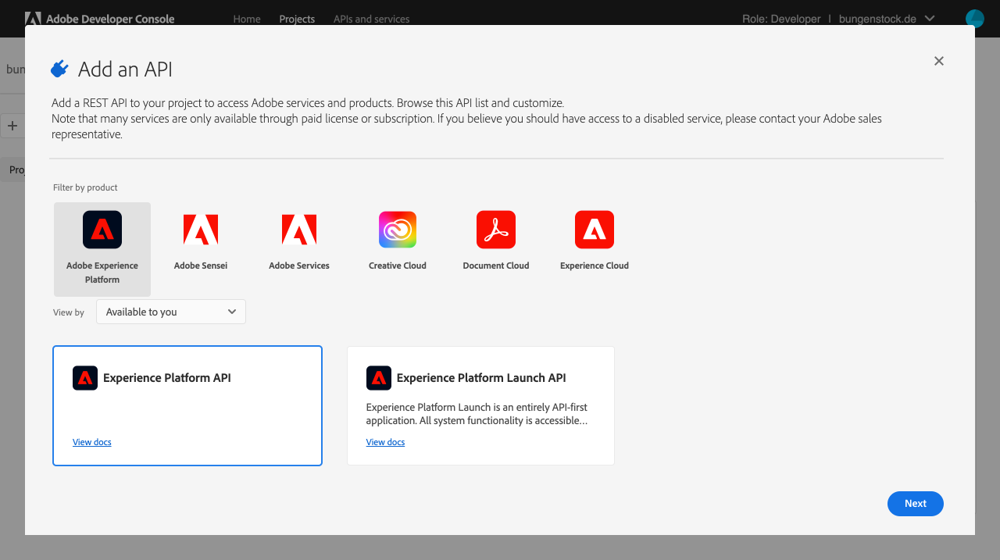
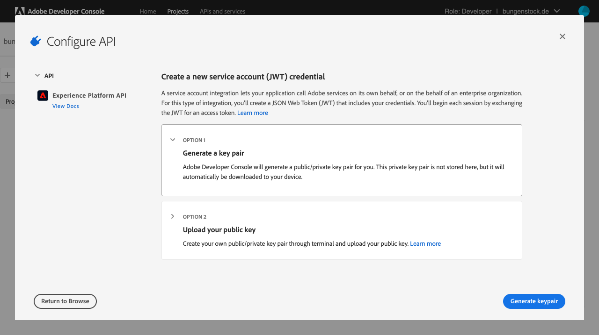
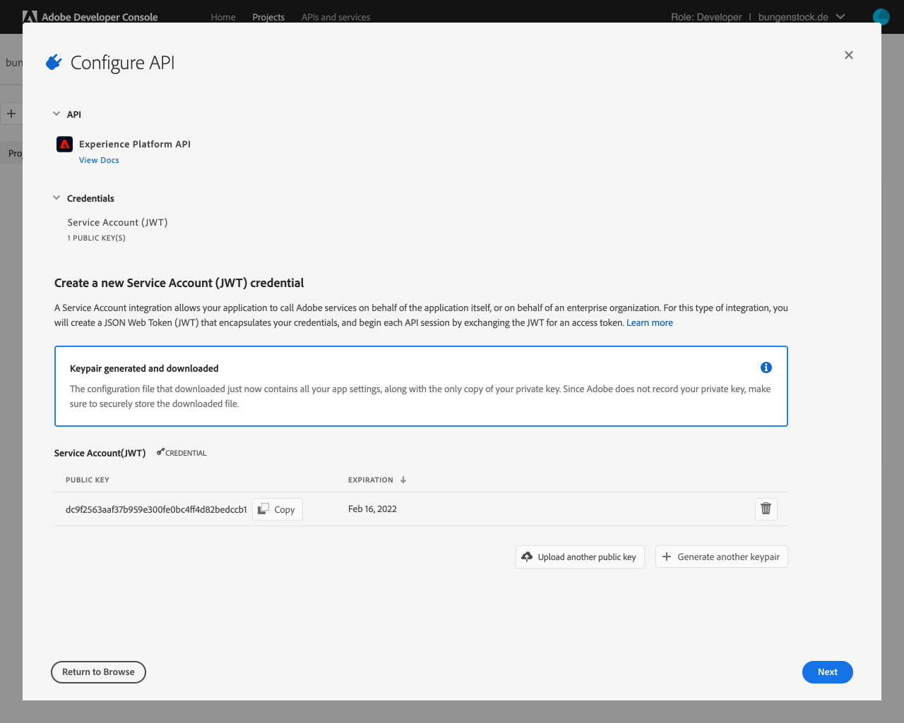
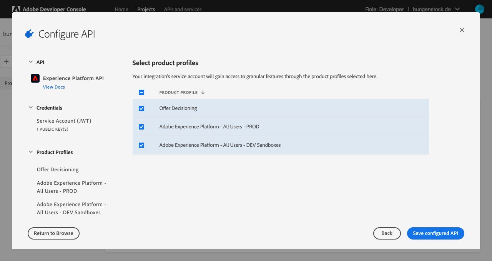

# Create new Adobe I/O Project
Go to to Adobe I/O console and select the [Projects tab](https://console.adobe.io/projects). Select an existing project or create a new one by clicking on the **Create new project** button.

Click on **Add API**

Use *Filter by product* by clicking **Adobe Experience Platform**. Select the
**Experience Platform API** tile and push the **Next** button.

You can use your own public/private key pair but in this case we choose OPTION 1
**Generate a key pair**

The download should start automatically and contains the private as well as the
public key. The private key will be used by `aepctl` and should be stored in a
safe place.

Activate the product profiles for the required features, in this example we choose all profiles, and store your settings by pushing the **Save configured API** button.

You are now done with the setup of the project and can use the provided data for the configuration of `aepctl`. See [README.md](../README.md) for more details.